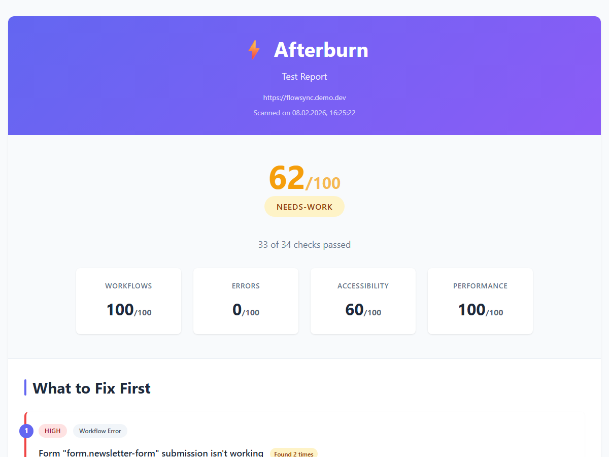

# Afterburn

[](https://www.npmjs.com/package/afterburn-cli)
[](https://opensource.org/licenses/MIT)
[](https://nodejs.org/)
[]()
[]()

**One command finds every bug on your website.** Zero config. Generates a report your AI coding tool can use to fix them automatically.

```bash
npx afterburn-cli https://your-site.com
```

```
Afterburn v1.0.0

✔ Checking browser...
✔ Crawling site...
✔ Testing workflows...
✔ Analyzing results...
✔ Generating reports...

Health: 62/100 — 20 issues found (0 high, 17 medium, 3 low)

Reports saved:
  HTML:     afterburn-reports/1770564079516/report.html
  Markdown: afterburn-reports/1770564079516/report.md
```

Afterburn crawls your site, fills out forms, clicks every button, and tells you what's broken -- in plain English for you, in structured Markdown for Claude, Cursor, or ChatGPT to auto-fix.

> **The AI workflow:** Afterburn finds the bugs. You paste the Markdown report into Claude, Cursor, or ChatGPT. It reads the reproduction steps and fixes them. You re-scan. Done.

## The AI-readable report (the killer feature)

Every scan generates **two reports**:

1. **HTML Report** -- A health score and prioritized bug list in plain English. For you to read.
2. **Markdown Report** -- Structured with reproduction steps and fix suggestions. Feed it directly to Claude, ChatGPT, or Cursor and your AI coding tool can **fix the bugs automatically**.

```
You: "Here's my Afterburn report. Fix these bugs."
AI:  *reads structured report, fixes 12 issues across 4 files*
```

This is the workflow: Afterburn finds the bugs, your AI fixes them. Zero manual debugging.

### What the AI report looks like

The Markdown report is structured so AI tools can parse and act on it:

```markdown
## Issues (Prioritized)

| # | Priority | Category | Summary | Location |
|---|----------|----------|---------|----------|
| 1 | HIGH | Workflow Error | Form "form#contact-form" submission isn't working | /contact |
| 2 | MEDIUM | Dead Button | Button "Get Started Free" doesn't do anything when clicked | / |
| 3 | MEDIUM | Console Error | An image failed to load | /images/icon-deploy.png |
```

Each issue includes a category, priority, plain-English summary, and location. Paste this into Claude or Cursor and it knows exactly what to fix.

### Sample reports

See what Afterburn produces when scanning a real app with 20+ intentional defects:



- [Sample HTML report](demo-cache/report.html) -- Health score, prioritized issues, fix suggestions
- [Sample Markdown report](demo-cache/report.md) -- Structured for AI coding tools
- [Terminal output](demo-cache/terminal-output.txt) -- What you see in the CLI

## What it catches

- Broken forms that don't submit
- Dead buttons that do nothing when clicked
- JavaScript errors and console crashes
- HTTP errors (404s, 500s, failed API calls)
- Broken images and missing assets
- Accessibility violations (WCAG 2.1 AA via axe-core)
- Slow page loads and poor performance scores

## Quick start

```bash
# No install needed -- run directly
npx afterburn-cli https://your-site.com

# Or install globally
npm install -g afterburn-cli
```

Afterburn downloads a browser automatically on first run (~200MB, one-time).

## Try it now

Scan any public website -- no signup, no API key, no config:

```bash
npx afterburn-cli https://en.wikipedia.org/wiki/Main_Page
```

Or point it at your own site to see what's broken.

### Common options

```bash
# Test login flows
npx afterburn-cli https://your-site.com --email test@example.com --password mypass123

# Hint at specific workflows
npx afterburn-cli https://your-site.com --flows "signup, checkout, profile edit"

# Map bugs to your source code (file:line)
npx afterburn-cli https://your-site.com --source ./src

# Watch the browser do its thing
npx afterburn-cli https://your-site.com --no-headless
```

Reports are saved to `./afterburn-reports/{timestamp}/`.

## How it works

```
Your URL --> Crawl all pages --> Plan test workflows --> Execute tests --> Analyze failures --> Generate reports
```

1. **Crawl** -- Discovers all pages, forms, buttons, and links. Handles SPAs (React, Next.js, Vue, Angular, Svelte).
2. **Plan** -- AI generates smart test workflows (or heuristic fallback with no API key).
3. **Execute** -- Runs each workflow in a real browser: fills forms, clicks buttons, captures screenshots.
4. **Analyze** -- Diagnoses root causes. AI vision analysis with Gemini, or pattern matching without.
5. **Report** -- Health score (0-100) and prioritized fix list in HTML + Markdown.

### AI is optional

Afterburn works **without any API keys**. Set `GEMINI_API_KEY` for smarter test planning and AI-powered diagnosis, but the core tool runs a full test suite either way.

```bash
# Optional: enable AI-powered planning and diagnosis
export GEMINI_API_KEY=your-key-here
```

## How is this different?

| Feature | Afterburn | Lighthouse | axe-core | Manual testing |
|---------|-----------|------------|----------|----------------|
| Zero config (no test writing) | Yes | Yes | Needs integration | Yes |
| Crawls entire site | Yes | Single page | No | Tedious |
| Form filling and submission | Yes | No | No | Manual |
| Dead button detection | Yes | No | No | If you notice |
| Plain English reports | Yes | Partial | No | N/A |
| AI-ready report for auto-fix | Yes | No | No | No |
| Free and open source | Yes | Yes | Yes | Free (your time) |
| CI/CD integration | GitHub Action | CI plugin | CI plugin | No |

## Health score

The health score (0-100) is weighted:

| Category | Weight | What it measures |
|----------|--------|------------------|
| Workflows | 40% | Did test workflows complete without errors? |
| Errors | 30% | HTTP errors, console crashes, broken resources |
| Accessibility | 20% | WCAG 2.1 AA violations |
| Performance | 10% | Page load times, LCP scores |

## Pre-flight check

```bash
npx afterburn-cli doctor
```

Checks Node.js version, browser installation, API key, and network connectivity.

## CLI reference

```
Usage: afterburn [options] [command] <url>

Automated testing for vibe-coded websites

Arguments:
  url                    URL to test

Options:
  -V, --version          output the version number
  --source <path>        Source code directory for pinpointing bugs
  --email <email>        Login email (or set AFTERBURN_EMAIL env var)
  --password <password>  Login password (tip: use AFTERBURN_PASSWORD env var
                         to avoid shell history exposure)
  --output-dir <path>    Custom output directory
                         (default: ./afterburn-reports/{timestamp})
  --flows <hints>        Comma-separated workflow hints (e.g., "signup, checkout")
  --max-pages <n>        Max pages to crawl (default: 50, max: 500)
  --no-headless          Show browser window (useful for debugging)
  --verbose              Show detailed progress output
  -h, --help             display help for command

Commands:
  doctor                 Check if your environment is ready to run Afterburn
```

## Known limitations

- **Visual analysis requires GEMINI_API_KEY**. Without it, UI analysis relies on axe-core plus pattern matching.
- **SPA support is experimental**. Complex client-side routing may not be fully exercised.
- **Desktop viewport only**. Tests run at 1920x1080. Mobile testing planned for v2.

## Three interfaces

### CLI

```bash
npx afterburn-cli https://your-site.com
```

### GitHub Action

```yaml
name: Afterburn
on: [pull_request]

jobs:
  test:
    runs-on: ubuntu-latest
    steps:
      - uses: actions/checkout@v4
      - uses: gods-strongest-vibecoder/afterburn@main
        with:
          url: https://your-staging-site.com
          fail-on: high
```

Posts a summary comment on your PR and uploads reports as artifacts. Action bundling coming in v1.1 -- for now, use the CLI in your CI workflow with `npx afterburn-cli`.

### MCP Server (for AI coding assistants)

```json
{
  "mcpServers": {
    "afterburn": {
      "command": "npx",
      "args": ["afterburn-mcp"]
    }
  }
}
```

Exposes a `scan_website` tool that returns structured results your AI assistant can act on.

## Tech stack

[Playwright](https://playwright.dev/) (browser automation) | [Gemini 2.5 Flash](https://ai.google.dev/) (AI vision, optional) | [axe-core](https://github.com/dequelabs/axe-core) (accessibility) | [Commander.js](https://github.com/tj/commander.js) (CLI) | [Handlebars](https://handlebarsjs.com/) (HTML reports) | [ts-morph](https://github.com/dsherret/ts-morph) (source mapping) | [sharp](https://sharp.pixelplumbing.com/) (screenshot compression)

## License

MIT

Built for the [BridgeMind Vibeathon 2026](https://bridgemind.dev).
